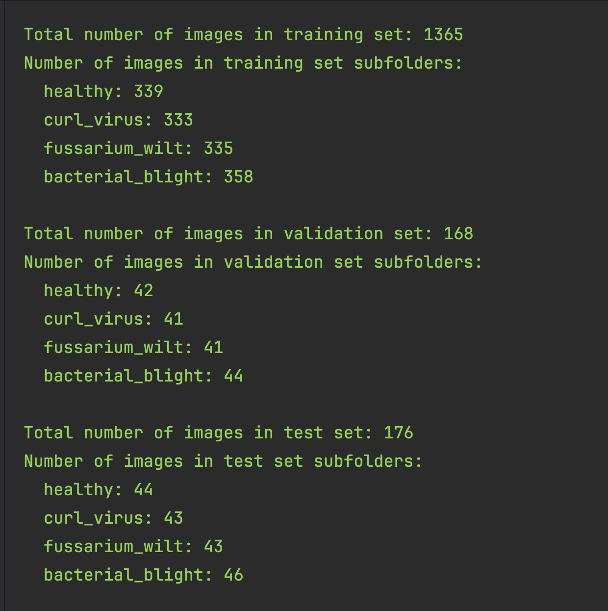
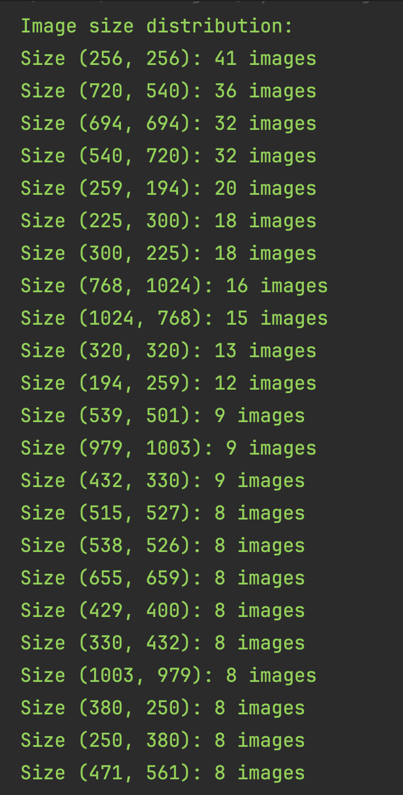
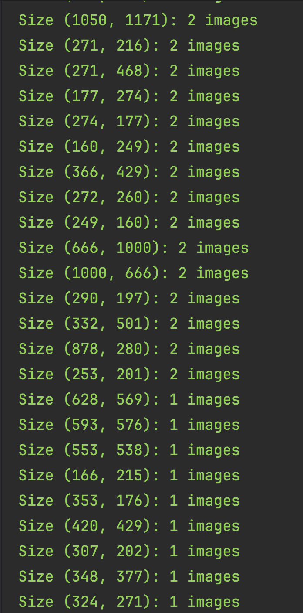
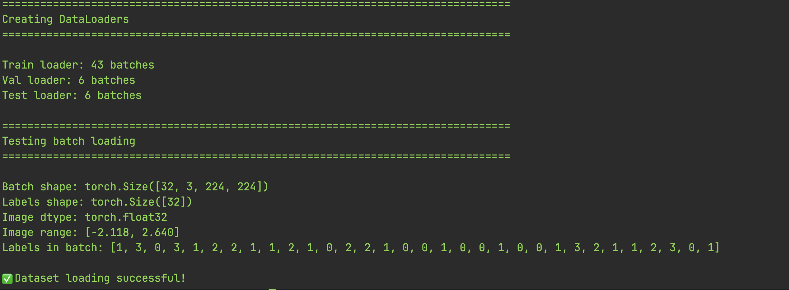

# Dataset Overview and Preprocessing Notes

This document is for my own reference. It summarizes the key preprocessing steps I run on the dataset and includes visual outputs that help me quickly understand structure and image sizes.

## Visual outputs (from runs and notes)

These outputs help me sanity-check data loading, splits, and size distributions.

- Split visualization
  - 
- Image size analysis (graphs)
  - 
  -   
  
- Data loaders overview
  - 

---

## Preprocessing steps

### 1) Image Size Analysis (scan_image_size.py)

Purpose:
- Read all images in the dataset and compute a distribution of resolutions.
- Use this distribution to decide a good input size for the CNN.

Script reference:
- File: [`ShunyaNet/Start/2-scan_image_sizes.py`](../../Start/2-scan_image_sizes.py)
- It scans the dataset splits (train/val/test) and prints a sorted size frequency table.

Example output format:
- 224x224 → 4 images
- 128x128 → 20 images
- 256x256 → 15 images

Notes:
- The script counts how many images exist for each `(width, height)` pair and reports totals.
- It also prints any file read errors and how many unique resolutions were found.
- The distribution helps me choose a single input size that minimizes distortion or cropping when I preprocess images for the model.

What I look for:
- If there is one dominant resolution, I can adopt that as the model input size.
- If resolutions vary significantly, I’ll pick a size that balances detail and computational cost (often 224, 256, or 299), and apply center-crop or letterboxing consistently.

### 2) Dataset Split (split_folder.py)

Purpose:
- Create `train`, `val`, and `test` splits in an 80:10:10 ratio.
- Verify counts per class in each split to ensure the dataset is properly divided.

Script reference:
- File: [`ShunyaNet/Start/1-Split-Folder.py`](../../Start/1-Split-Folder.py)
- Uses `splitfolders.ratio(...)` to create the three directories.
- After splitting, it counts images per subfolder and prints totals.

Output expectations:
- A clear summary of how many images exist in `train`, `val`, and `test`.
- Counts per class inside each split directory.

Notes:
- I run this once per raw dataset location (e.g., `Data/train_images` as input, `Data/PaddyDisease` as output).
- If the split output already exists, I keep the seed fixed to maintain reproducibility.
- I check warnings for missing folders and verify final totals match expectations.

---

- Scripts:
  - [`ShunyaNet/Start/2-scan_image_sizes.py`](../../Start/2-scan_image_sizes.py) (image size distribution)
  - [`ShunyaNet/Start/1-Split-Folder.py`](../../Start/1-Split-Folder.py) (splits and counts)
