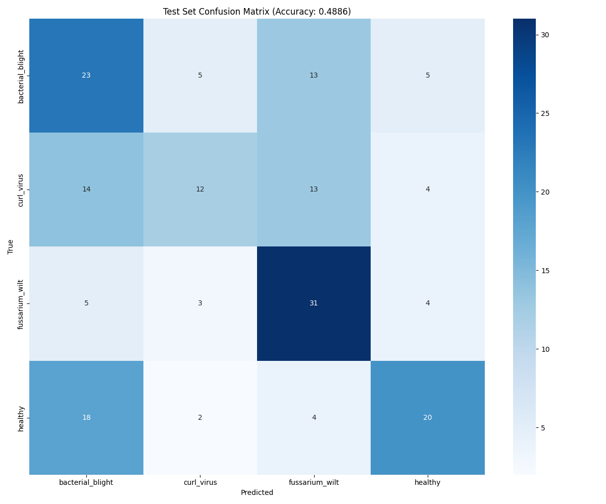

# Cotton Disease Recognition — Training Summary

This document summarizes all my training phases for the Cotton Disease Recognition model. Each phase has its own folder with detailed notes, results, and checkpoints. Below is a quick overview and links to each phase.

---

## 📋 Training Phases Overview

1. **[Phase 0 — MacBook Air M1 (8GB RAM)](./TrainingPhase0-MacM1)**
   - *Sanity check run on MacBook Air M1 (8GB RAM)*
   - Only 1 epoch completed (too slow, laptop overheated)
   - **Accuracy:** N/A (stopped after 1 epoch)
   - **Checkpoint:** [`best_model.pth`](./TrainingPhase0-MacM1/checkpoints/best_model.pth)
   - **Confusion Matrix:** 
   - **Observation:** Pipeline works, but MacBook Air is not practical for full training. Switched optimizer to Adam, tuned batch size and learning rate for next phases.

2. **[Phase 1 — Windows Laptop (i7 12th Gen, 16GB RAM)](./TrainingPhase1-output)**
   - *Moved to a more powerful Windows laptop*
   - **Epochs:** 42, **Batch size:** 16, **Early stopping:** 15
   - **Best Accuracy:** 38.1% (test)
   - **Test Loss:** 1.36
   - **Checkpoint:** [`checkpoint_epoch_15.pth`](./TrainingPhase1-output/checkpoints/checkpoint_epoch_15.pth)
   - **Confusion Matrices:**
     - 
   - **Observation:** Training feasible, but accuracy still low. Adam optimizer and learning rate tuning helped. Some classes (like 'bacterial_blight') not recognized at all. Next: more tuning, data augmentation.

3. **[Final Phase — Windows Laptop (i7 12th Gen, 16GB RAM)](./TrainingPhaseFinal-output)**
   - *Final run with more aggressive early stopping and data augmentation*
   - **Epochs:** 42, **Batch size:** 16, **Early stopping:** 32 (stopped at epoch 35)
   - **Best Accuracy:** 48.9% (test)
   - **Test Loss:** 1.33
   - **Checkpoint:** [`checkpoint_epoch_35.pth`](./TrainingPhaseFinal-output/checkpoints/checkpoint_epoch_35.pth)
   - **Confusion Matrices:**
     - 
   - **Observation:** Data augmentation applied, but model still struggles to differentiate some classes. Training stopped early due to no improvement. Dataset quality and class separability are main bottlenecks now.

---

## 🔎 General Observations & Improvements

- **Hardware matters:** MacBook Air M1 (8GB RAM) is not suitable for deep learning training. Windows laptop (i7, 16GB RAM) made a huge difference.
- **Optimizer:** Switching from SGD to Adam improved convergence.
- **Batch size & learning rate:** Tuning these helped with stability and speed.
- **Early stopping:** Prevented overfitting, but sometimes stopped before real improvement.
- **Data augmentation:** Helped a bit, but not enough — dataset itself is a limiting factor.
- **Class imbalance / separability:** Some classes (like 'bacterial_blight') are still hard for the model to recognize.

---
