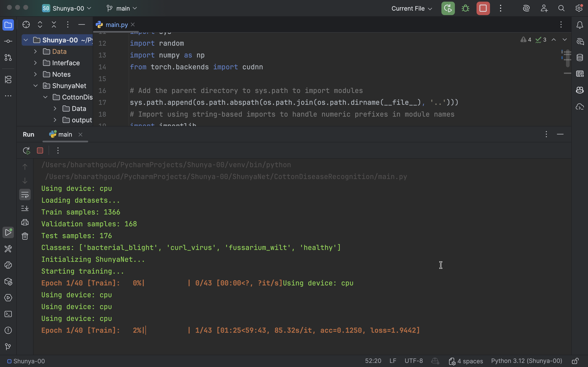
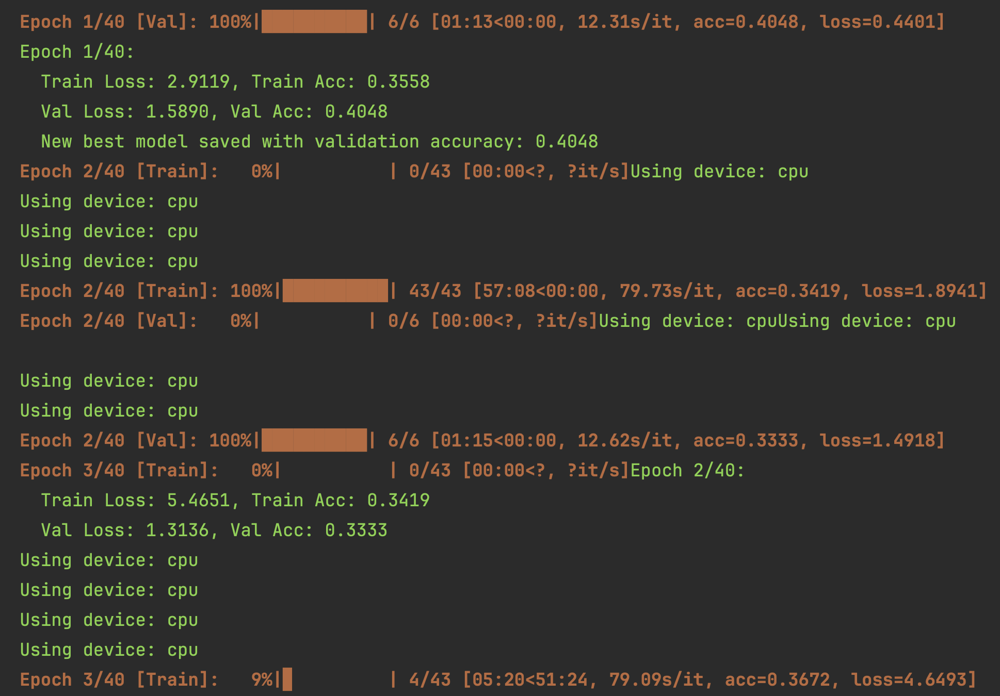
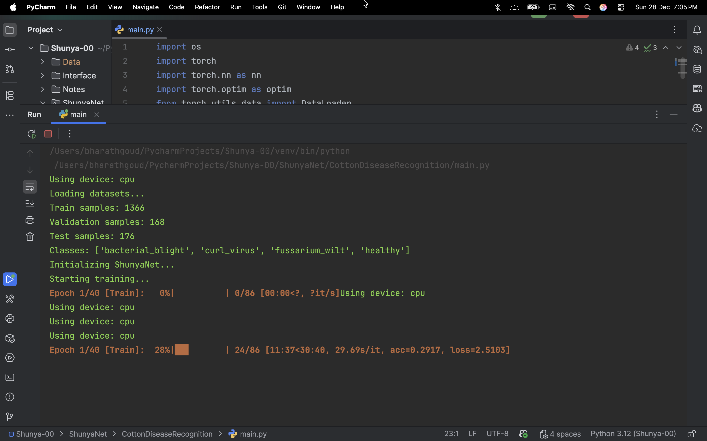
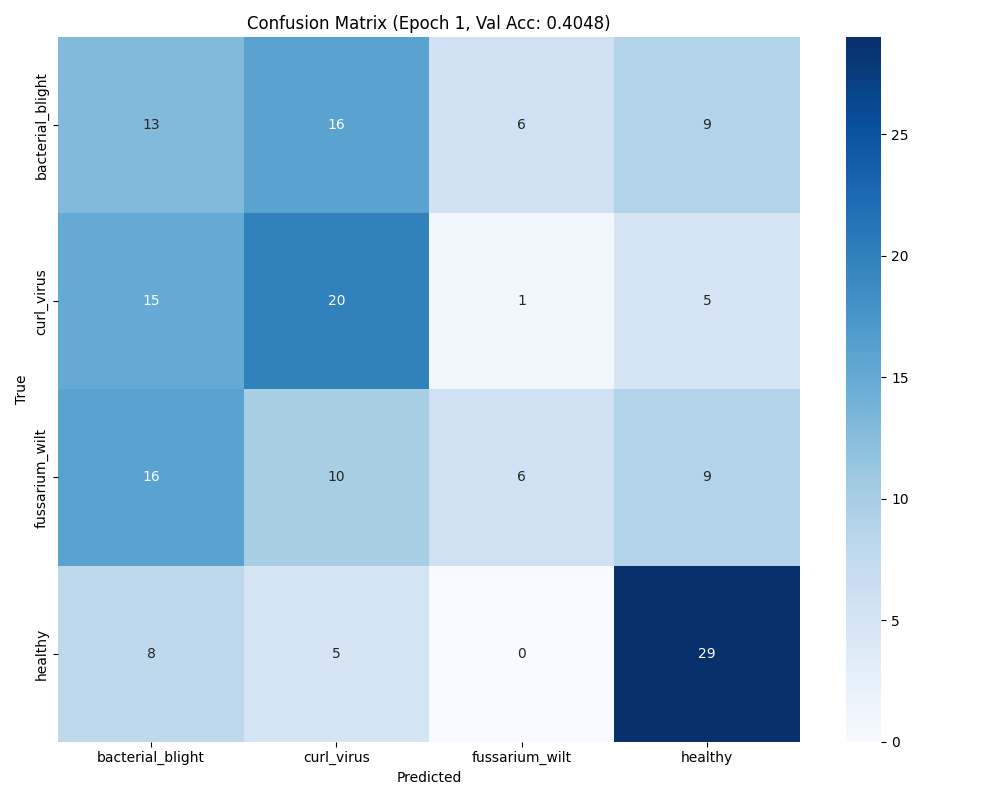

# Training Phase 0 — MacBook Air M1 (8GB RAM)

This folder is my **Phase 0** training attempt for the Cotton Disease Recognition model.

I started training on my **MacBook Air M1 (8GB RAM)** just to see if the pipeline works end‑to‑end (dataset → dataloaders → model → training loop → metrics). It *did* run, but I couldn’t finish a full training run on this machine.

---

## What happened in Phase 0

- Training was extremely slow on my Mac.
- It was taking **~1 hour for a single epoch**.
- The laptop was getting **too hot**, so I stopped the run after **Epoch 1**.

So Phase0 is basically: **sanity check + 1 epoch run**.

---

## While training (screenshots)

These screenshots are captured from the **first epoch** training + validation.

### Training (Epoch 1)

### Validation (Epoch 1)

### Training Epoch1 batch size 16 terminal output

---

## Results (after Epoch 1)

This is the confusion matrix saved at the end of the first epoch.

> Note: Because I stopped after 1 epoch, these metrics are not a “final result”. This is just what I got from the first pass.

---

## Checkpoints

- I saved the best checkpoint during this short run here:
  - `./checkpoints/best_model.pth`

---

## Changes I made after Phase 0

After stopping this run, I updated a few things in the model/training setup to get better and faster results for the next phases:

- **Batch size**: changed (to improve speed/memory handling)
- **Learning rate**: tuned
- **Optimizer**: changed from **SGD → Adam** (for better convergence)

These changes are used in the next training phases (Phase1 / Phase2), because Phase0 on Mac wasn’t practical for long runs.

---

## Notes / Takeaway

Phase0 helped me confirm:

- the dataset is loading correctly,
- training + validation steps are working,
- checkpoint + result generation works.

But for longer training (multiple epochs), I needed a better setup than MacBook Air M1 8GB.

