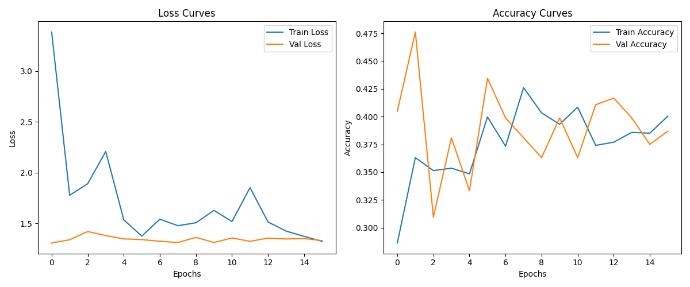
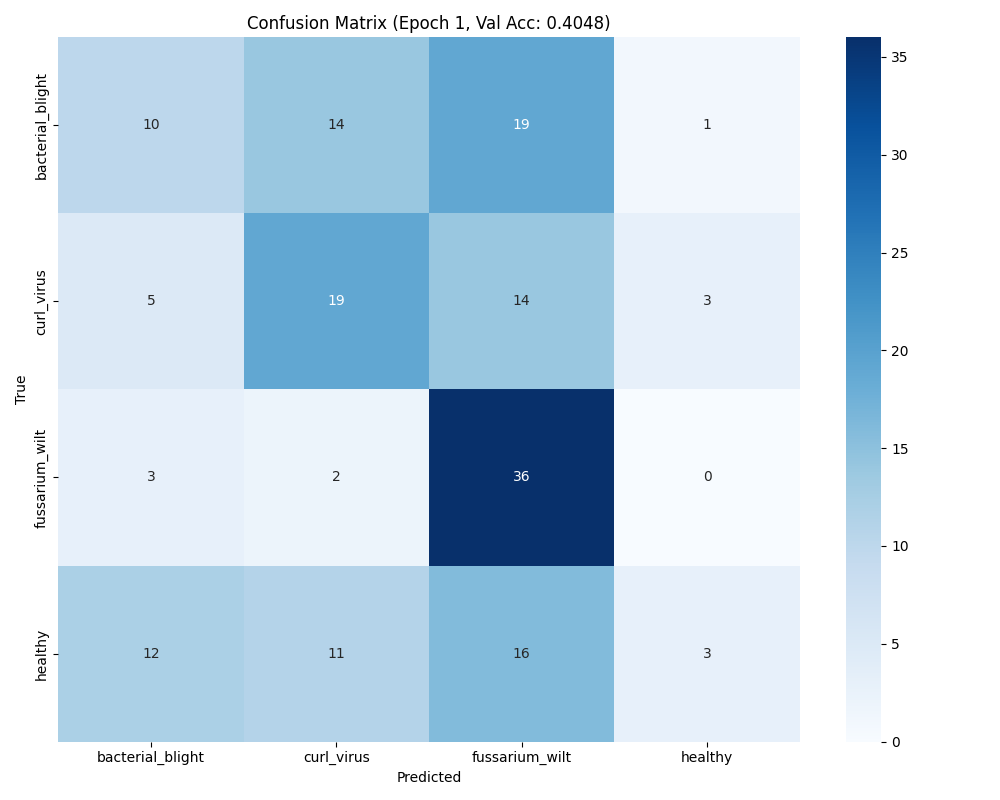
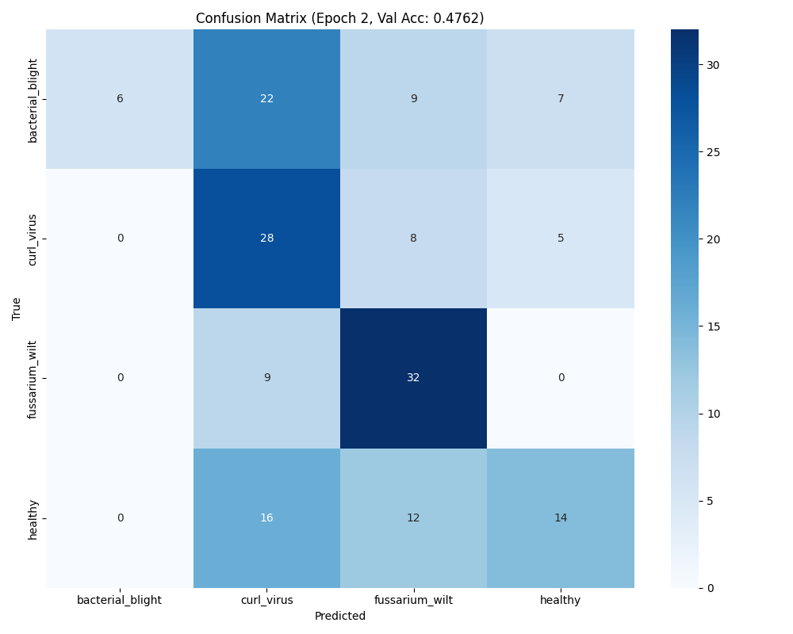
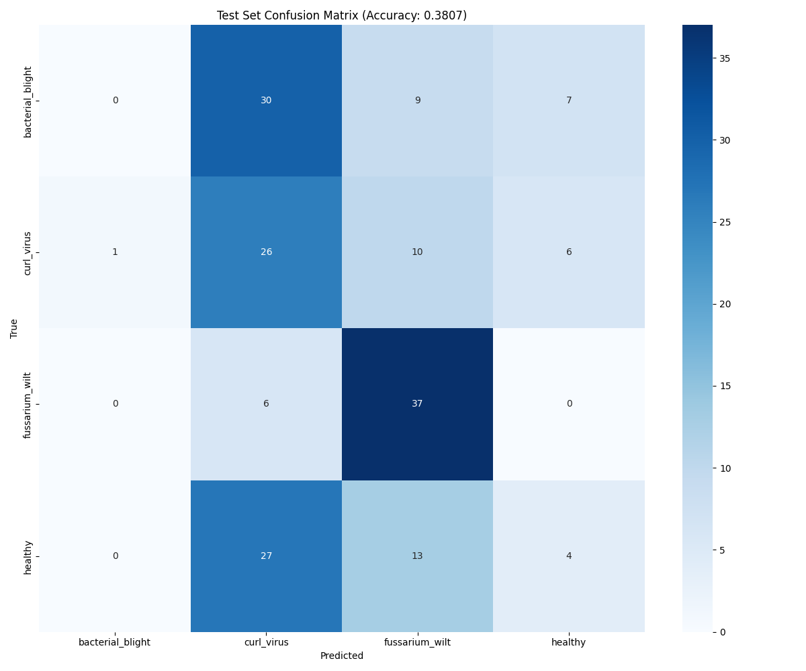

# Cotton Disease Recognition Training - Phase 0 & Phase 1

## Phase 0: Initial Training Attempt (MacBook Air M1, 8GB RAM)

- Tried to train the model on my MacBook Air M1 (8GB RAM).
- Training was extremely slow: ~1 hour per epoch.
- The laptop was overheating, so I stopped after just 1 epoch.
- Initial parameters: higher batch size, default learning rate, and SGD optimizer.
- After 1 epoch, I realized this setup was not practical for my hardware.

## Changes Made After Phase 0
- Switched optimizer from SGD to Adam for better convergence.
- Reduced batch size to fit memory constraints.
- Tuned the learning rate for more stable training.

---

## Phase 1: Training on Windows Laptop (Intel i7 12th Gen, 16GB RAM)

- Moved training to a Windows laptop (Intel i7 12th Gen CPU, 16GB RAM).
- Updated parameters:
  - **Batch size:** 16
  - **Epochs:** 42
  - **Early stopping:** 15
  - **Learning rate:** tuned for Adam optimizer
- Training time per epoch: ~25 minutes (much better than MacBook Air)

### Results
- **Test Loss:** 1.36
- **Test Accuracy:** 38.1%

#### Classification Report
```
                  precision    recall  f1-score   support
bacterial_blight     0.00       0.00      0.00        46
curl_virus           0.29       0.60      0.39        43
fussarium_wilt       0.54       0.86      0.66        43
healthy              0.24       0.09      0.13        44

accuracy                                 0.38       176
macro avg            0.27       0.39      0.30       176
weighted avg         0.26       0.38      0.29       176
```

### Training History


### Confusion Matrices
- **Epoch 1:**
  
- **Epoch 2:**
  
- **Test Set:**
  

---
## Checkpoints
- best model: `checkpoints/checkpoint_epoch_15.pth` (based on validation accuracy)
---

## Observations
- Switching to a more powerful machine made training feasible.
- Adam optimizer and learning rate tuning helped stabilize training.
- Early stopping was set to 15 to avoid overfitting.
- Model performance is still not ideal (accuracy ~38%), with some classes (like 'bacterial_blight') not being recognized at all.
- 'fussarium_wilt' class performed best, while 'healthy' and 'bacterial_blight' need improvement.
- Next steps: further tuning, data augmentation, or model architecture changes.


