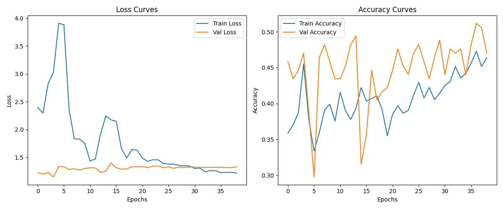
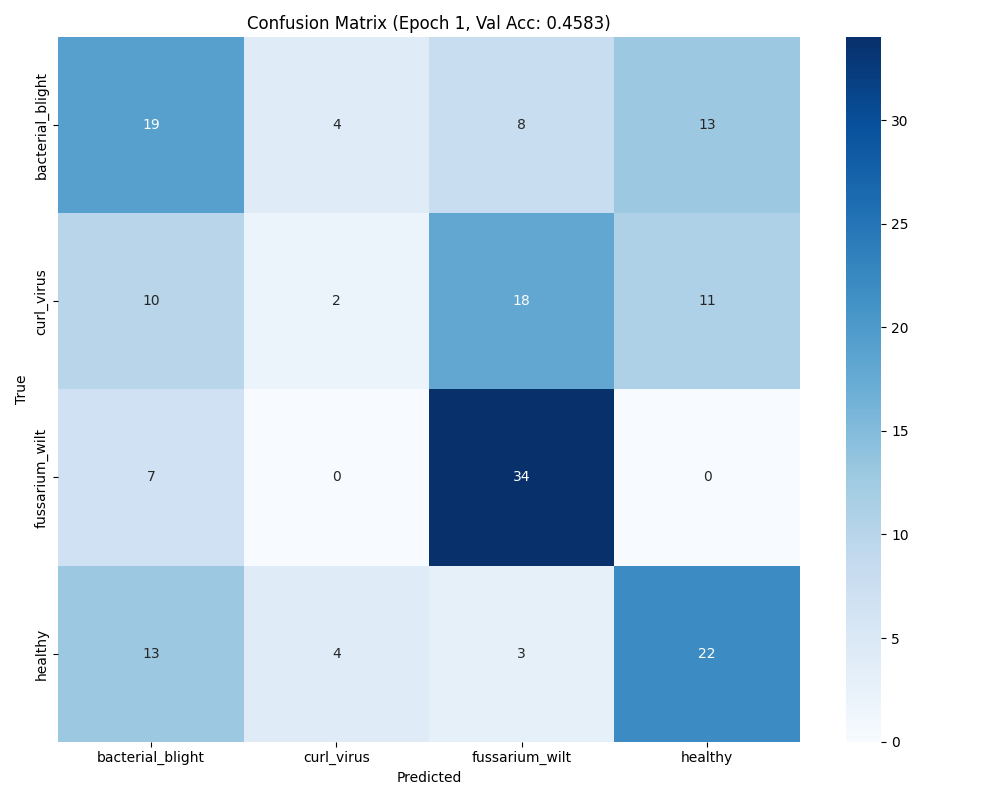
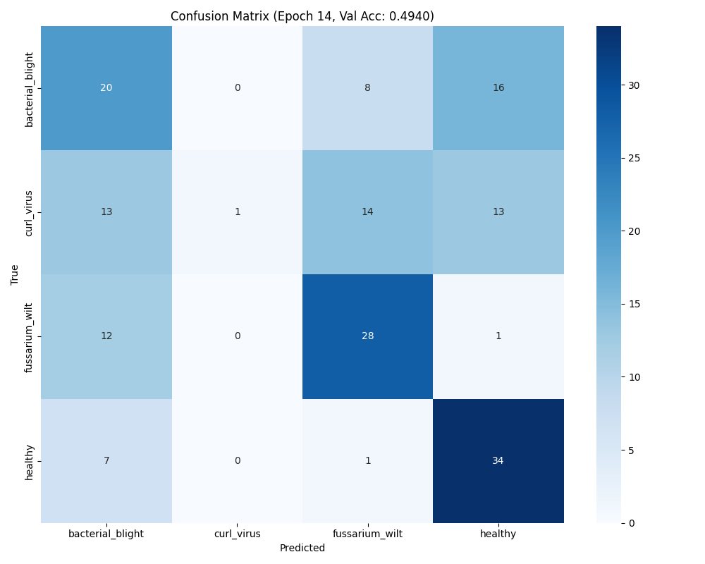
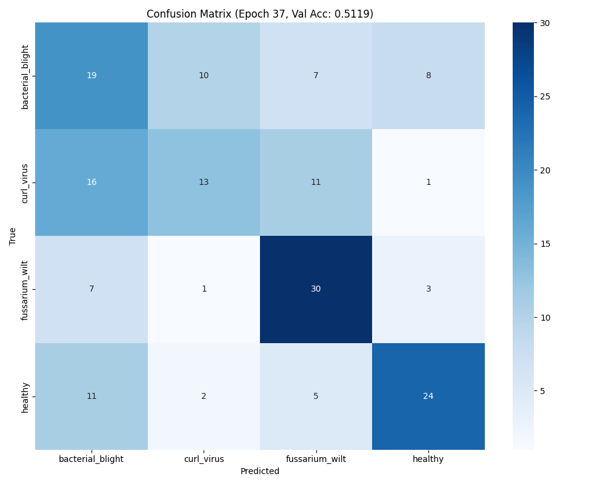

# Cotton Disease Recognition - Final Training Phase

## Final Training Setup
- **Epochs:** 42
- **Batch size:** 16
- **Early stopping:** 32
- Model trained until epoch 35 (stopped early due to no improvement in accuracy).
- Data augmentation was applied, but the dataset still proved challenging for the model.

## Results
- **Test Loss:** 1.33
- **Test Accuracy:** 48.9%

#### Classification Report
```
                  precision    recall  f1-score   support
bacterial_blight     0.38       0.50      0.43        46
curl_virus           0.55       0.28      0.37        43
fussarium_wilt       0.51       0.72      0.60        43
healthy              0.61       0.45      0.52        44

accuracy                                 0.49       176
macro avg            0.51       0.49      0.48       176
weighted avg         0.51       0.49      0.48       176
```

### Training History


### Confusion Matrices
- **Epoch 1:**
  
- **Epoch 14:**
  
- **Epoch 37:**
  
- **Test Set:**
  

### Checkpoints
- Model checkpoint saved at: `checkpoints/checkpoint_epoch_35.pth`

---

## Observations
- Even after applying data augmentation, the model struggled to clearly differentiate between some classes.
- Training stopped at epoch 35 due to early stopping (no improvement in validation accuracy).
- The best accuracy achieved was about 49% on the test set.
- 'healthy' and 'fussarium_wilt' classes performed better, but 'curl_virus' and 'bacterial_blight' are still problematic.
- The dataset quality and class separability seem to be the main bottlenecks now.


