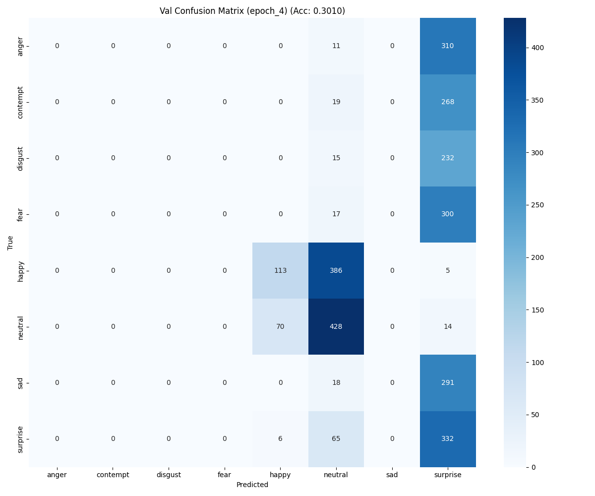
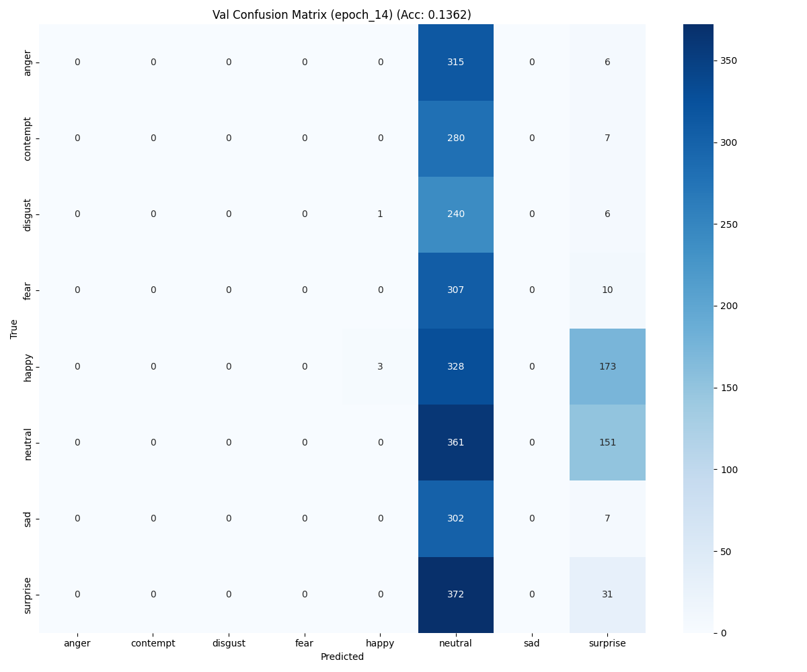
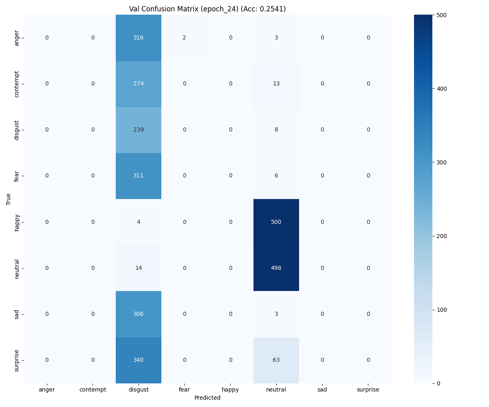
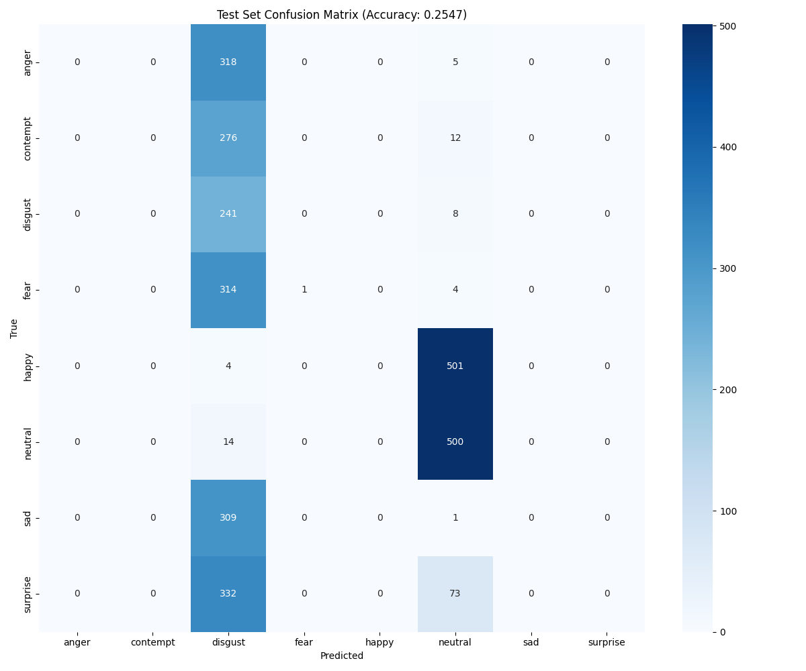

# Emotion Recognition – Training Phase 2 Results

## 📊 Results

### Validation – Confusion Matrices (Eval Epochs)

- Epoch 5

- Epoch 15

- Epoch 25

### Test – Confusion Matrix (Epoch 25)

### Test Report (Epoch 25)
- Test Loss: 1.9663
- Test Accuracy: 0.2547
- Class-wise highlights:
  - neutral — precision 0.4529, recall 0.9728, F1 0.6180
  - disgust — precision 0.1333, recall 0.9679, F1 0.2343
  - fear — precision 1.0000, recall 0.0031, F1 0.0063
  - anger, contempt, happy, sad, surprise — near 0 precision/recall
- Macro avg: precision 0.1983, recall 0.2430, F1 0.1073
- Weighted avg: precision 0.2008, recall 0.2547, F1 0.1298

## 🧭 Observations
- Predictions collapse heavily into `neutral` (high recall) and sometimes `disgust`.
- Many classes have near-zero recall across epochs → likely imbalance or feature confusion.
- Loss improved over epochs; accuracy peaked near eval epoch 20.

## ⚠️ Problems Faced During Training
- Planned training length: 60 epochs, early stopping patience: 35.
- Training was interrupted due to a power issue and did not run for the intended duration.
- Because of the shorter effective training, the model likely didn’t fully learn class boundaries beyond the dominant classes (e.g., `neutral`).
- Checkpoint selected around epoch 25 reflects partial learning rather than the intended convergence.

## 🔧 Improvements Needed (Next Iterations)
- Data balance and sampling
  - Verify class distribution; rebalance if needed.
  - Use `WeightedRandomSampler` during training to counter imbalance.
- Loss/optimization
  - Try class-weighted CrossEntropy or Focal Loss to focus on hard/minority classes.
  - Add label smoothing to stabilize training.
  - Tune LR schedule (e.g., cosine annealing with warm restarts) and consider longer patience.
- Augmentation and input pipeline
  - Strengthen augmentations for minority classes; ensure per-class diversity.
  - Review normalization stats to match dataset specifics.
- Model head and calibration
  - Calibrate logits (temperature scaling) and review last-layer capacity.
  - Consider adding dropout or adjusting classifier width.
- Training runtime & robustness
  - Resume training from latest checkpoint and extend to full planned epochs.
  - Implement reliable resume-on-failure and autosave to handle interruptions.
- Evaluation diagnostics
  - Track per-class PR curves and confusion matrices across more epochs.
  - Add threshold analysis and log misclassified examples for targeted fixes.
