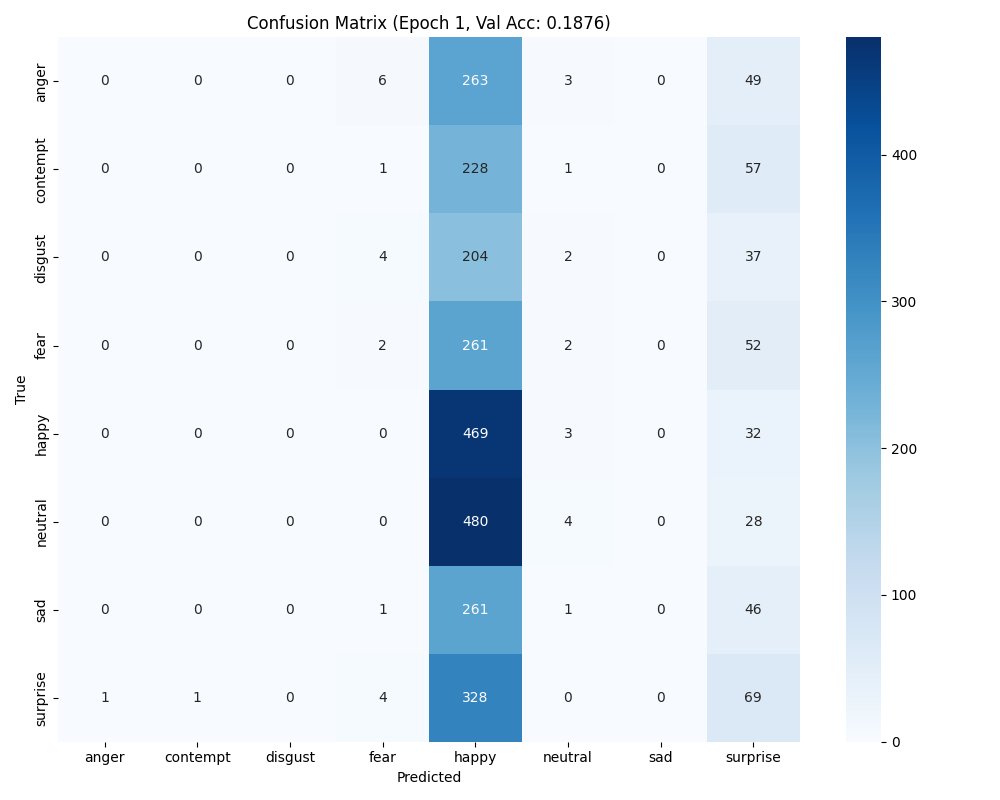
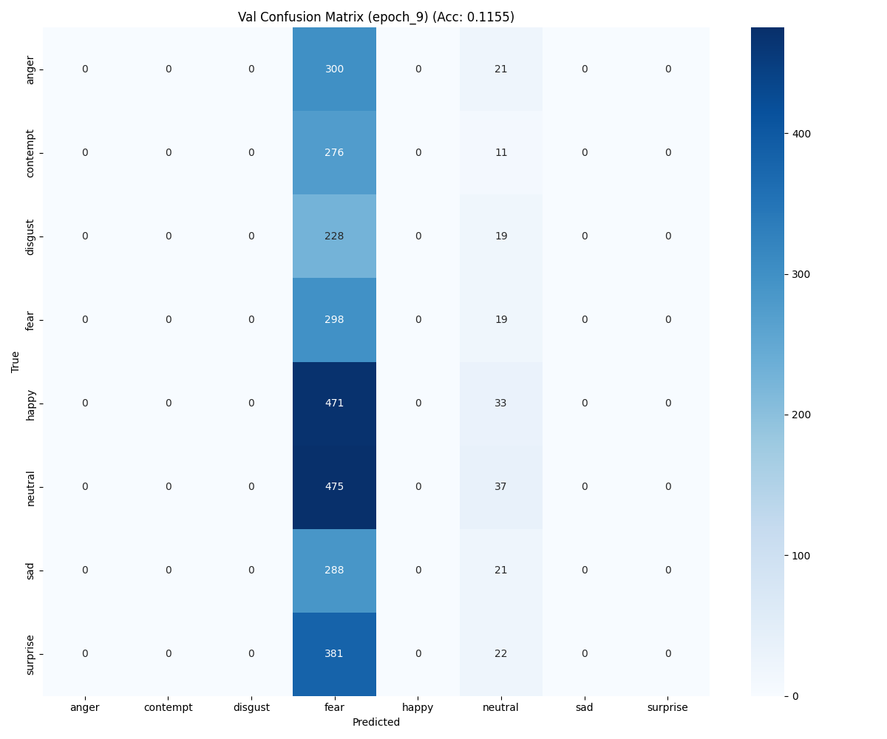
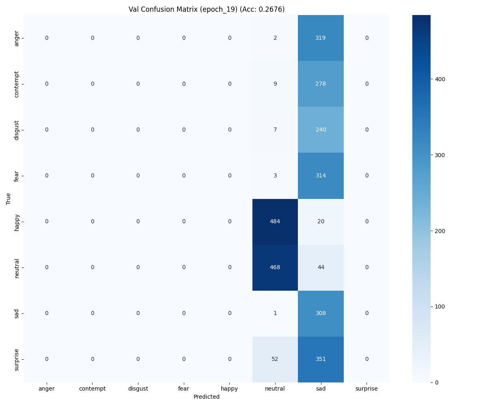

# Emotion Recognition – Training Phase 3 Results

A concise, visual snapshot of validation outcomes for Phase 3 with observations, issues faced, and next-step improvements.

## 📦 Artifacts
- Checkpoint: [`./checkpoints/`](./checkpoints/) → `checkpoint_epoch_20.pth`
- Results: [`./results/`](./results/) (confusion matrices)
- Reports: [`./results/reports/`](./results/reports/) — `val_classification_report_eval_epoch_5.txt`, `..._10.txt`, `..._20.txt`

## 📊 Visual Results

### Confusion Matrices (Selected Epochs)

- Epoch 1 (Train)

- Epoch 10 (Validation)

- Epoch 20 (Validation)

## 🧪 Validation Report Highlights (Epochs 5, 10, 20)
- Epoch 5 — Val Loss: 1.9381, Val Acc: 0.3010
  - neutral: recall 0.8359 (F1 0.5819)
  - surprise: recall 0.8238 (F1 0.3081)
  - happy: F1 0.3261 (precision 0.5979, recall 0.2242)
- Epoch 10 — Val Loss: 2.0733, Val Acc: 0.1155
  - fear: recall 0.9401 (precision 0.1097, F1 0.1964)
  - most other classes near 0 recall
- Epoch 20 — Val Loss: 2.0003, Val Acc: 0.2676
  - neutral: recall 0.9141 (F1 0.6086)
  - sad: recall 0.9968 (F1 0.2822)
  - others near 0

## 🧭 Observations
- Predictions concentrate into a few classes (neutral consistently high recall; sometimes surprise/sad spike in recall).
- Many classes show near-zero recall across epochs → imbalance or representation issues.
- Validation accuracy is volatile; best observed around eval epoch 5 and 20, but overall remains low.

## ⚠️ Problems Faced During Training
- Planned training length: 60 epochs, early stopping patience: 35.
- Training failed to continue due to a power cut, so Phase 3 did not reach the intended duration.
- The model likely did not learn robust boundaries beyond dominant classes; checkpoint at epoch 20 reflects incomplete convergence.

## 🔧 Improvements Needed (Next Iterations)
- Data & sampling
  - Ensure class balance across splits; consider oversampling minority classes.
  - Use `WeightedRandomSampler` during training.
- Loss & optimization
  - Adopt class-weighted CrossEntropy or Focal Loss.
  - Add label smoothing; consider cosine annealing with warm restarts.
- Augmentations
  - Strengthen per-class augmentations for minority labels.
  - Validate normalization stats against dataset.
- Model head & calibration
  - Temperature scaling for logits; review classifier width and add dropout if needed.
- Training robustness
  - Implement resume-on-failure; autosave checkpoints more frequently.
  - Extend training to full 60 epochs when power/runtime is stable.
- Evaluation diagnostics
  - Track per-class PR curves; log misclassified samples per epoch.
  - Add threshold analysis to understand decision boundaries.
