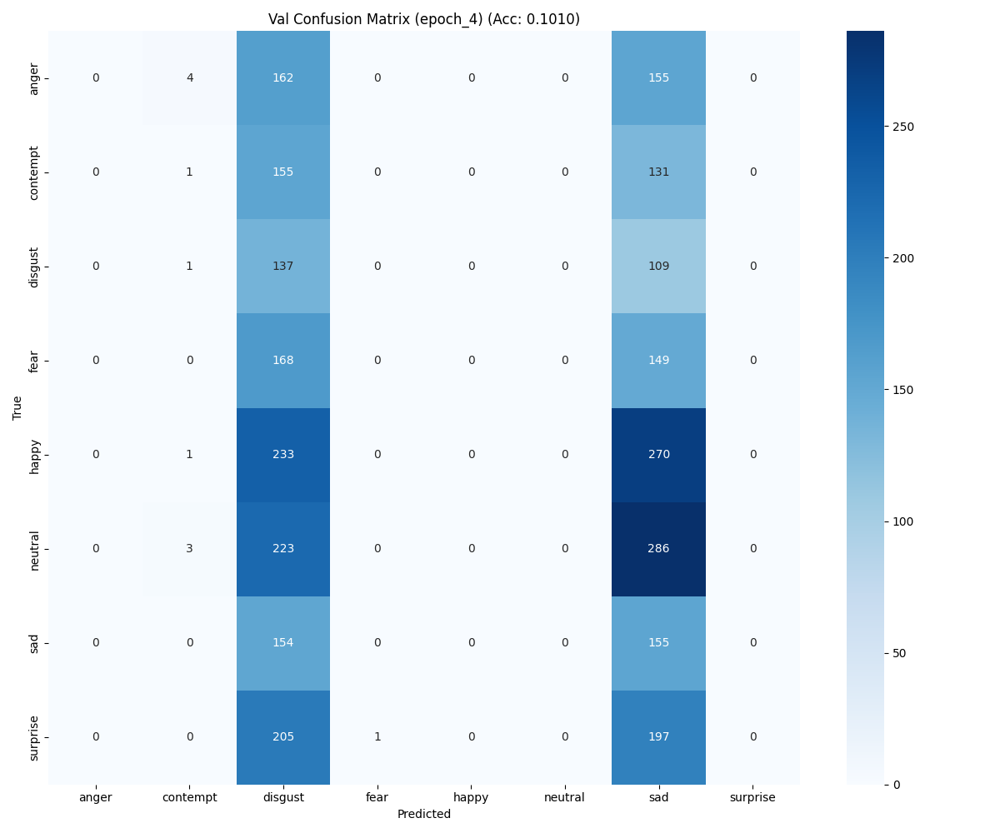
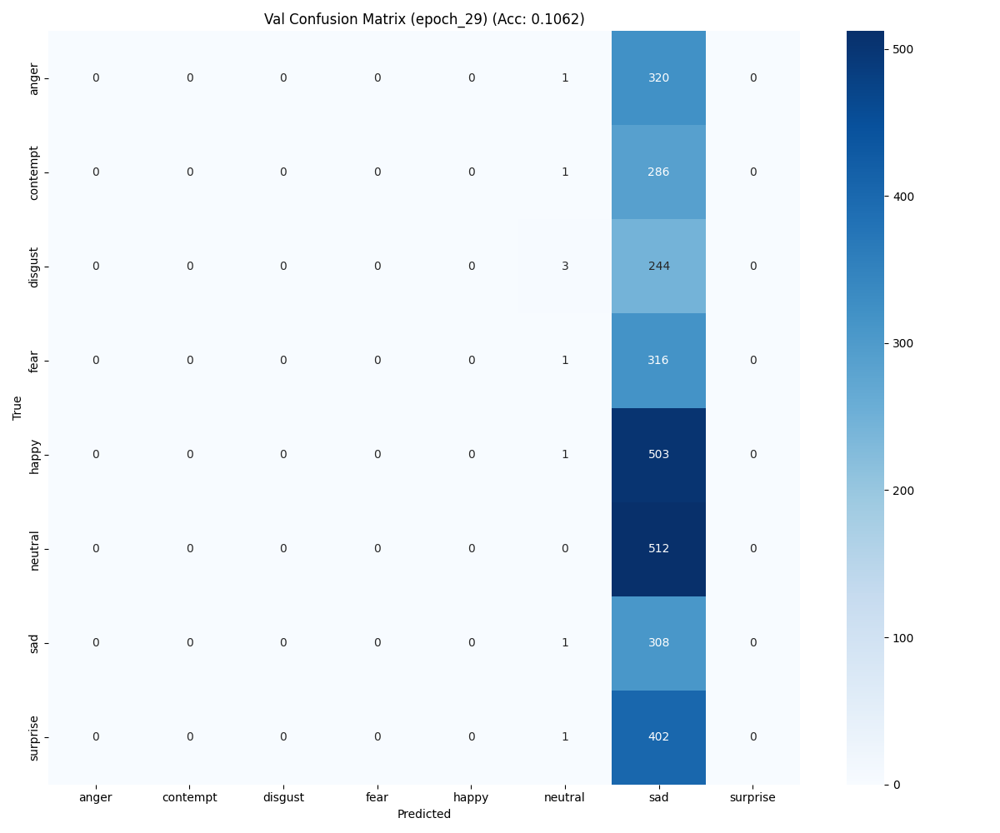
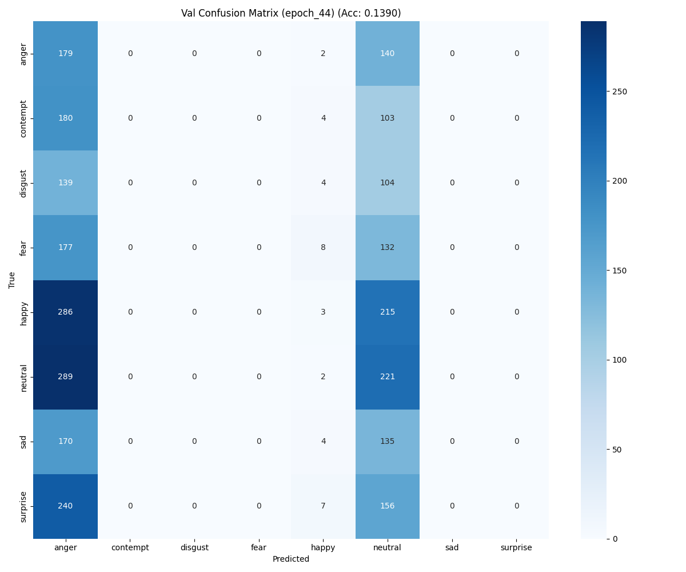
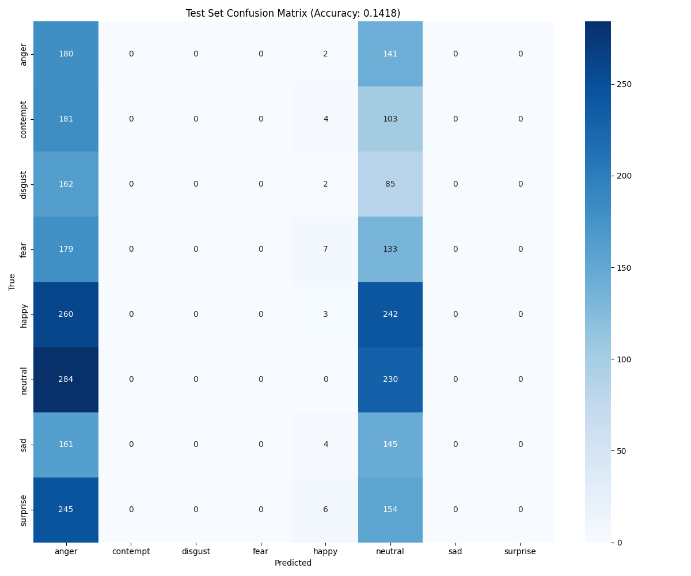

# Emotion Recognition – Training Phase 4 Results

A concise, visual snapshot of validation and test outcomes for Phase 4 with observations and next-step improvements.

## 📦 Artifacts
- Checkpoint: [`./checkpoints/`](./checkpoints/) → `checkpoint_epoch_45.pth`
- Results (Confusion Matrices): [`./confusionMatrix/`](./confusionMatrix/)
- Reports: [`./Reports/`](./Reports/) — validation classification reports

## 📊 Results

### Validation – Confusion Matrices (Eval Epochs)

- Epoch 5

- Epoch 30

- Epoch 45

### Test – Confusion Matrix (Best Epoch)

## 🧪 Metrics & Reports (Key Epochs)
- Epoch 5 — Val Loss: 4.5602, Val Acc: 0.1010
  - disgust: recall 0.5547 (F1 0.1627)
  - sad: recall 0.5016 (F1 0.1760)
  - others near 0
- Epoch 10 — Val Loss: 13.0181, Val Acc: 0.1738
  - happy: recall 1.0000 (precision 0.1738, F1 0.2961)
  - others near 0
- Epoch 20 — Val Loss: 7.1332, Val Acc: 0.1766
  - neutral: recall 1.0000 (precision 0.1766, F1 0.3001)
  - others near 0
- Epoch 45 — Val Loss: 2.2666, Val Acc: 0.1390
  - anger: recall 0.5576 (F1 0.1807)
  - neutral: recall 0.4316 (F1 0.2573)

### Test Report (Epoch 45)
- Test Loss: 2.2669
- Test Accuracy: 0.1418
- Class-wise highlights:
  - anger — precision 0.1090, recall 0.5573, F1 0.1823
  - neutral — precision 0.1865, recall 0.4475, F1 0.2633
  - happy — precision 0.1071, recall 0.0059, F1 0.0113
  - contempt, disgust, fear, sad, surprise — near 0 precision/recall
- Macro avg: precision 0.0503, recall 0.1263, F1 0.0571
- Weighted avg: precision 0.0636, recall 0.1418, F1 0.0686

## 🧭 Observations
- Training experienced interruptions due to internal issues in Phase 4.
- The model fails to distinguish between many classes; predictions are biased towards a few labels (anger/neutral clusters) and show near-zero recall elsewhere.
- Data augmentation applied uniformly across all classes likely amplified bias toward majority classes; minority classes didn’t gain enough diversity.
- Metrics indicate data-induced bias: single-class dominance emerges at various epochs (happy at epoch 10, neutral at epoch 20), then shifts, suggesting instability and imbalance.

## ⚠️ Problems Faced During Training
- Training was interrupted due to internal issues and did not consistently reach intended run durations.
- Primary issue is biased data distribution leading to poor class separability and generalization.
- Augmentation strategy was uniform; classes with more samples benefited disproportionately, further skewing the model.

## 🔧 Improvements Needed (Next Iterations)
- Data balance and sampling
  - Audit class distribution across train/val/test; rebalance to reduce bias.
  - Use `WeightedRandomSampler` and class-balanced loss during training.
- Augmentation (class-specific)
  - Apply stronger augmentations only to classes with fewer images (minority labels).
  - Reduce/limit augmentations for majority classes to avoid reinforcing bias.
  - Consider per-class pipelines: e.g., more rotation/jitter for minority classes, minimal transforms for dominant classes.
- Loss/optimization
  - Adopt Focal Loss or class-weighted CrossEntropy; add label smoothing.
  - Consider calibration (temperature scaling) for logits.
- Architecture & regularization
  - Review classifier head capacity; add dropout.
  - Try mixup/cutmix to regularize and reduce overfitting to dominant classes.
- Training & evaluation
  - Track per-class PR curves and confusion matrices per eval epoch.
  - Log misclassifications and hard examples; perform error analysis per class.
