# Paddy Diseases dataset – visuals and notes

This page is for my own reference. It shows the outputs from the dataset split and image-size analysis, plus short notes on why each step matters.

## Scripts that produce these outputs
- Validation split creation and dataset summary: [`preprocess/DataArrange.py`](../preprocess/DataArrange.py)
- Image size analysis and visualization: [`preprocess/analyze_image_sizes.py`](../preprocess/analyze_image_sizes.py)
- Test data helpers (for Kaggle-style unlabeled test set): [`preprocess/test_data_utils.py`](../preprocess/test_data_utils.py)

## Before splitting
- What the dataset looked like before any split
  - 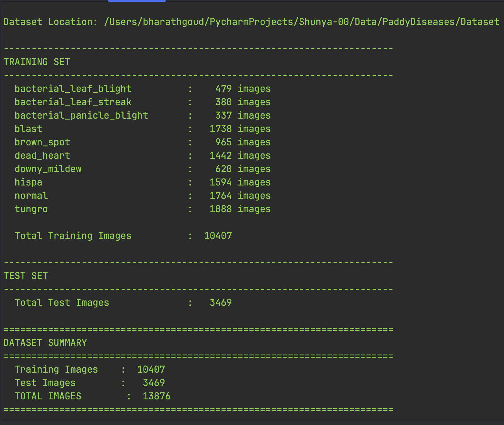

## Split summary and class counts
- Overall dataset summary after preparing train/val/test
  - 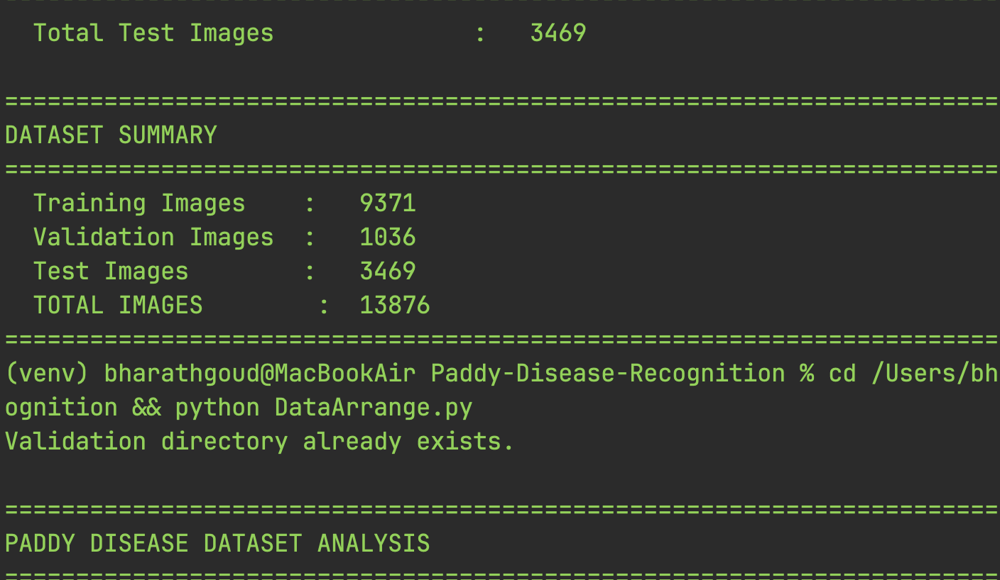
  - 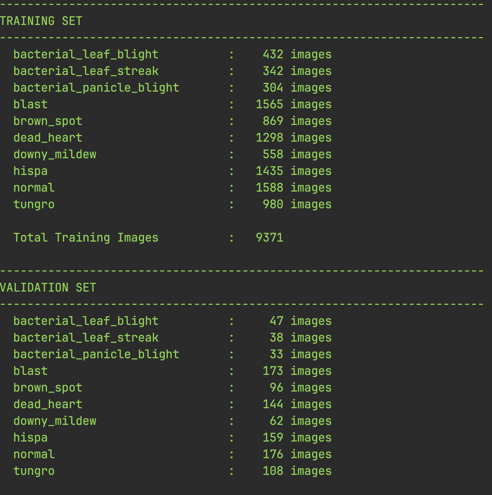
  - 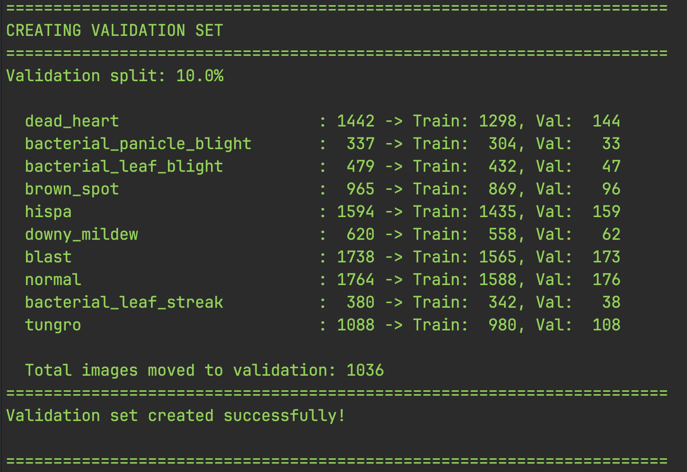
- Train/Val/Test per-class counts
  - Train classes and counts
    - 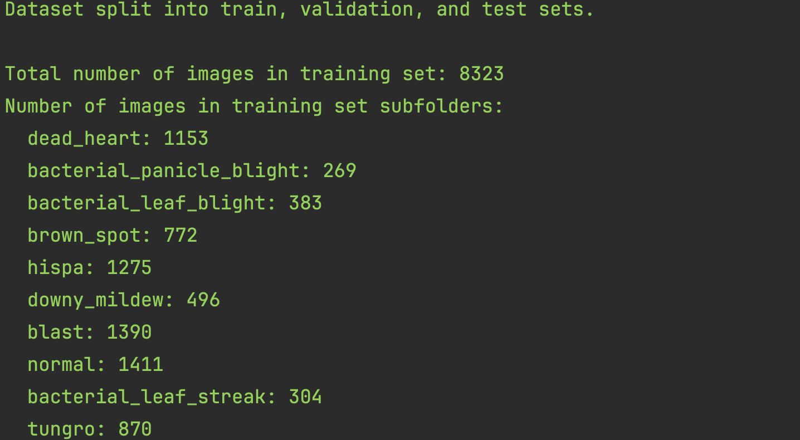
  - Validation classes and counts
    - 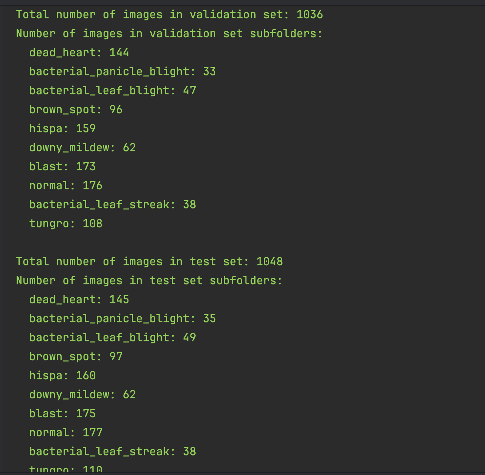

## Image-size analysis (what resolutions exist)
- Combined visualization from the analysis step
  - 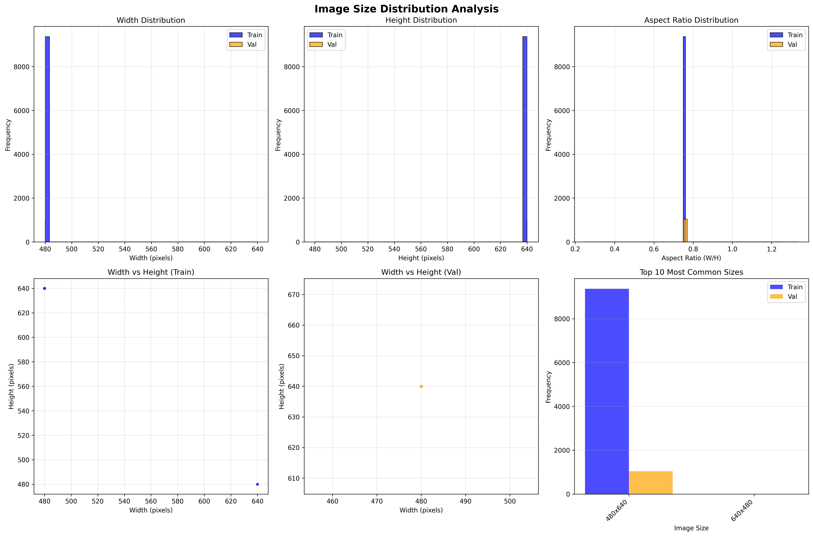
- Scan outputs and size distribution snapshots (helpful for quick review)
  - 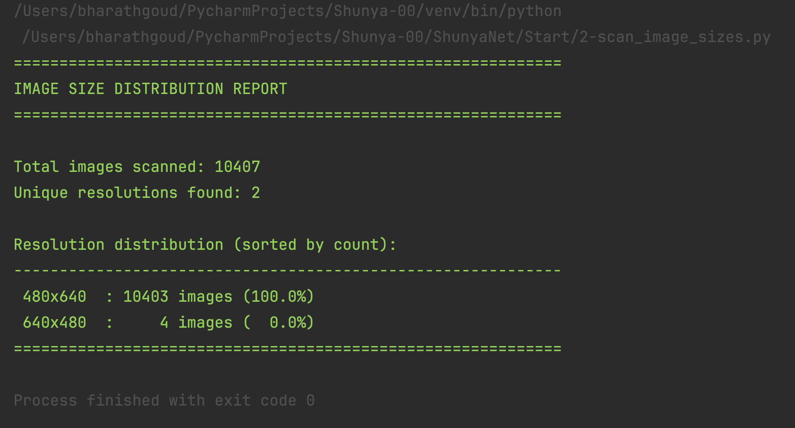
  - 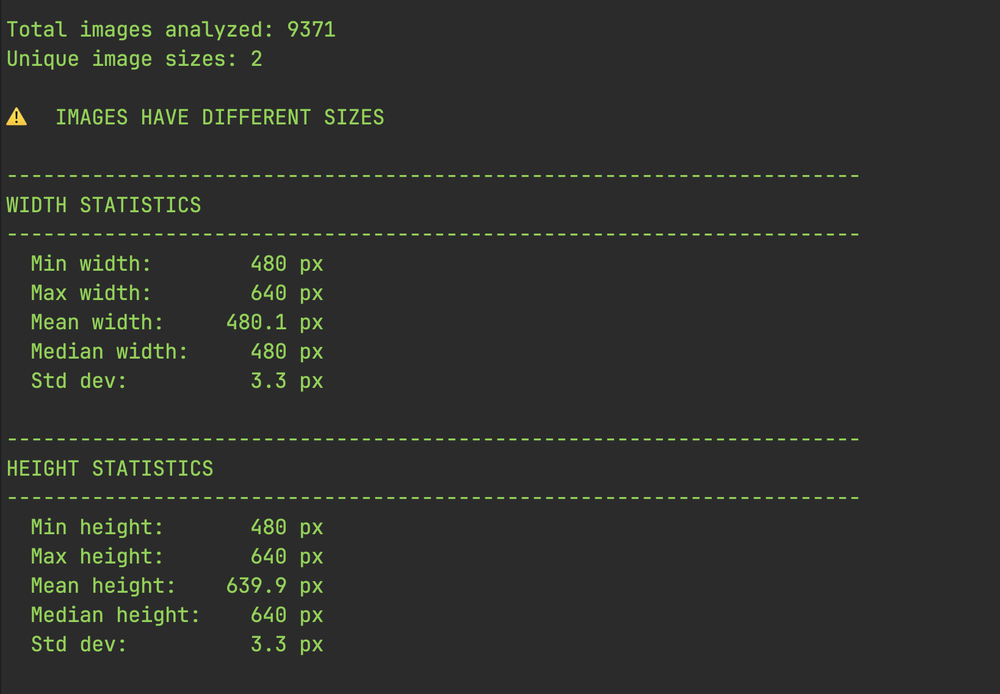
  - 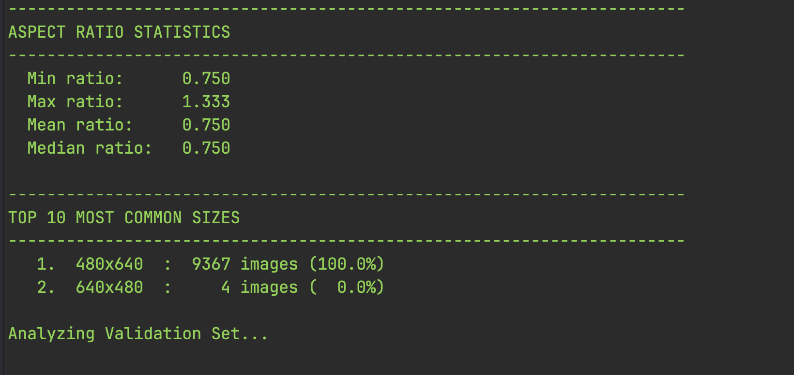
  - 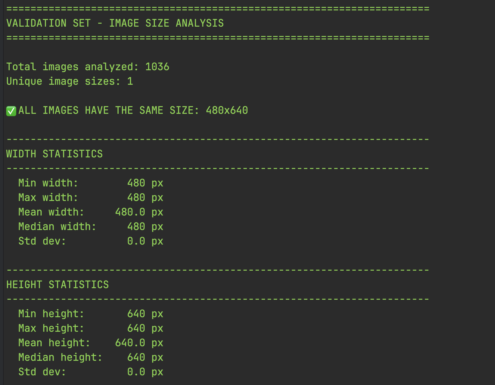
  - 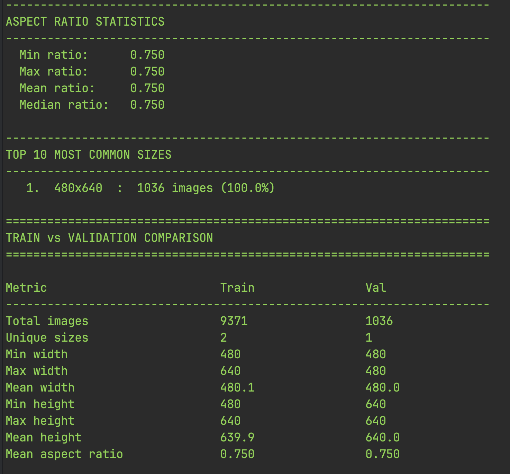
  - 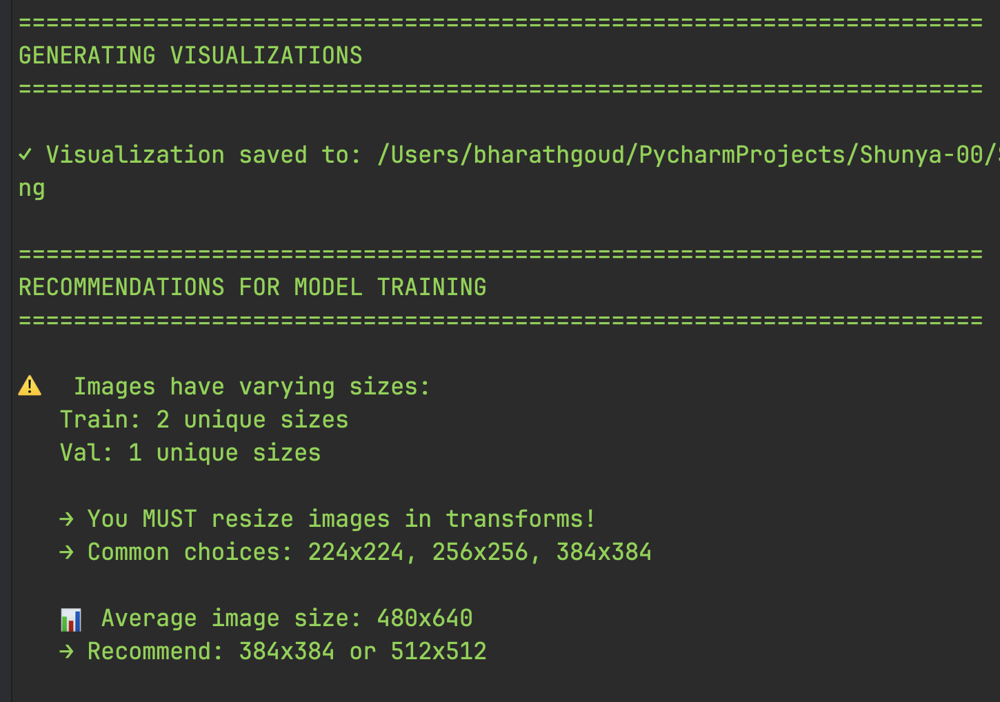

## Why these steps matter to me
- Dataset split
  - Makes a clean training structure: train for learning, val for evaluation/tuning, test for blind predictions.
  - I verify class counts per split so there are no surprises later.
- Image size analysis
  - Shows how many unique resolutions exist and how consistent widths/heights are.
  - Helps me choose a single model input size (e.g., 224, 256, 384, or 512) and the right resize/crop strategy.
  - I have chosen an image size of 224×224 for training the model after analyzing the dataset.

