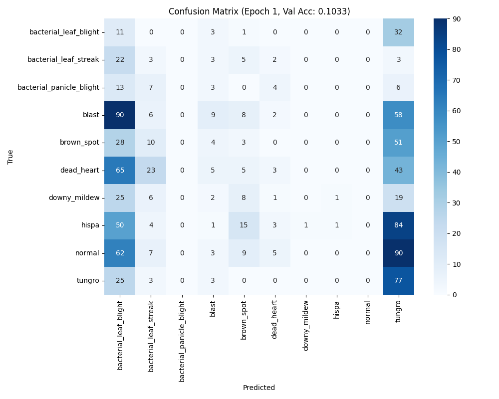
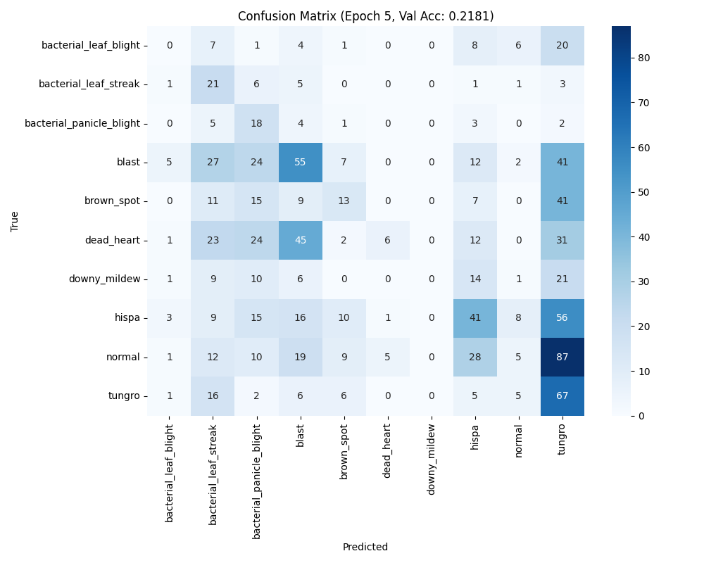
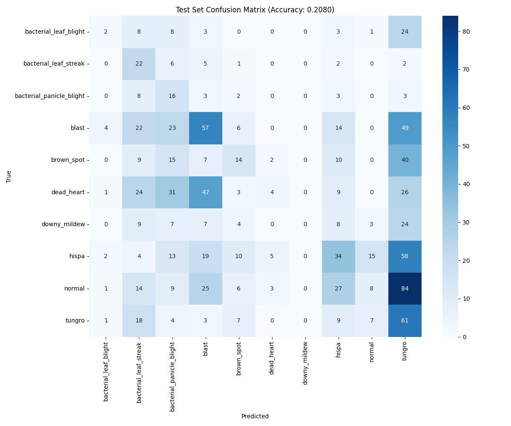

# Training Phase 3 — PyTorch ShunyaNet (Paddy Disease) ⚡️

Phase 3 where ShunyaNet was trained using the PyTorch implementation on the paddy disease dataset. This run prioritized speed and throughput; PyTorch performed faster compared to the TensorFlow/Keras setup.

---
## What was done
- Used ShunyaNet (PyTorch version) for paddy disease classification (10 classes).
- Same dataset and splits: `Data/PaddyDisease/` → `train/`, `val/`, `test/`.
- Augmentations matched prior phases (crop/flip/rotation/color jitter/blur) via PyTorch transforms.
- Checkpointing, history logging, and evaluation artifacts saved.
- Note: Training was interrupted due to a power issue; partial results are still available.

## Key Training Settings (Phase 3)
- Framework: PyTorch
- Backbone: ShunyaNet
- Input size: 224×224 RGB
- Batch size: small (to fit memory), tuned for throughput
- Optimizer: AdamW
- LR schedule: Reduce on plateau
- Loss: CrossEntropyLoss
- Regularization: weight decay, DropBlock equivalent where applicable

## Outputs-  Phase 3
- [checkpoints](checkpoints)
 

  
### Confusion Matrix (Test)

### Test Report (Checkpoint Epoch 5)
```
Test Loss: 2.2769, Test Accuracy: 0.2080
```
Full classification report: see `./test_classification_report_checkpoint_epoch_5.txt`

---
## Observations
- Training speed: PyTorch achieved faster epochs and better throughput than TensorFlow/Keras on the same dataset and hardware.
- Current test metrics (checkpoint epoch 5):
  - Test accuracy ≈ 0.208
  - Test loss ≈ 2.277
- Class-wise behavior (from the report):
  - Higher recalls observed for `bacterial_leaf_streak` and `tungro` relative to others.
  - `blast` and `hispa` show moderate precision/recall but still significant confusion across classes.
  - Very low recall for `downy_mildew` and `dead_heart` indicating underfitting or class imbalance/feature overlap.
- Confusion matrix shows heavy misclassifications into dominant classes (e.g., `tungro`, `normal`) across several labels.
- Training/interruption: run was cut short due to a power issue; results reflect the latest completed epoch (5). Expect improvements upon resuming training with continued scheduling and potential tuning.

## Quick Takeaways
- PyTorch training is operational and faster per epoch vs TensorFlow/Keras in this project.
- Current accuracy is low (≈20.8%) at checkpoint epoch 5; needs more epochs, tuning, and possibly class-balanced strategies.
- Next steps: resume from the last checkpoint, adjust LR/batch size, strengthen augmentation, consider focal loss or class weights, and validate improvements over subsequent epochs.
