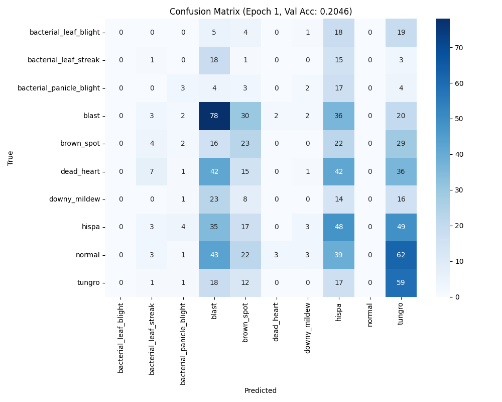

# Training Phase 4 — PyTorch ShunyaNet (Paddy Disease) ⚡️

Phase 4 continues training with the PyTorch implementation of ShunyaNet on the paddy disease dataset. Focus here is test‑set checks per epoch and a direct comparison of class behavior across epochs.

---
## What was done
- Continued PyTorch training with the same dataset splits: `train/`, `val/`, `test/` (10 classes).
- Kept augmentations consistent (crop/flip/rotation/color jitter/blur) and logged per‑epoch artifacts.
- Saved checkpoints and test evaluations at selected epochs.

## Outputs (Where to find)
- Checkpoint: [checkpoints/checkpoint_epoch_10.pth](./checkpoints/checkpoint_epoch_10.pth)
- Test Report (Epoch 10): `./test_classification_report_checkpoint_epoch_10.txt`

---
## Test: Confusion Matrices

### Epoch 1 (Test)


### Epoch 12 (Test)


---
## Test: Classification Report (Epoch 10)  


```
Test Loss: 2.2788, Test Accuracy: 0.1508

Classification Report:
                          precision    recall  f1-score   support

   bacterial_leaf_blight     0.0000    0.0000    0.0000        49
   bacterial_leaf_streak     0.0000    0.0000    0.0000        38
bacterial_panicle_blight     0.0632    0.6571    0.1153        35
                   blast     0.0000    0.0000    0.0000       175
              brown_spot     0.0000    0.0000    0.0000        97
              dead_heart     0.0000    0.0000    0.0000       145
            downy_mildew     0.0000    0.0000    0.0000        62
                   hispa     0.1684    0.6125    0.2642       160
                  normal     0.0000    0.0000    0.0000       177
                  tungro     0.3627    0.3364    0.3491       110

                accuracy                         0.1508      1048
               macro avg     0.0594    0.1606    0.0728      1048
            weighted avg     0.0659    0.1508    0.0808      1048
```

---
## Observations
- Speed: PyTorch continues to be faster per epoch vs TensorFlow/Keras, allowing more frequent test checks.
- Overall accuracy (test): stayed low in this phase around 15–20% (Epoch 10 report shows 0.1508). Loss ~2.28 indicates underfitting on test.
- Class‑wise behavior:
  - Consistently higher recall for `hispa` and `tungro` compared to other classes; these classes attract many predictions.
  - `bacterial_panicle_blight` shows unusually high recall at Epoch 10, but with very low precision → strong class bias/misclassification into this label.
  - Very poor recall for `blast`, `brown_spot`, `dead_heart`, `downy_mildew`, `normal` — most predictions diverted to a few dominant classes.
- Confusion matrices (Epoch 1 → Epoch 12) show heavy concentration into specific columns (e.g., `hispa`, `tungro`) with minimal true‑positive signals in many other classes, suggesting:
  - Data imbalance and/or insufficient discriminative features learned for several classes.
  - Potential over‑reliance on features that correlate to a subset of classes.
- Checkpoint (Epoch 10): stored for resume; continuing training with better balancing or loss re‑weighting should improve minority class recall.

## Next Steps
- Resume from `checkpoint_epoch_10.pth` and extend training.
- Address imbalance: class weights or focal loss; oversampling or mixup/cutmix targeting low‑recall classes.
- Input pipeline tweaks: stronger/targeted augmentation for minority classes, and verify normalization/stats.
- LR/batch tuning: consider cosine schedule and try slightly larger batch if feasible.

